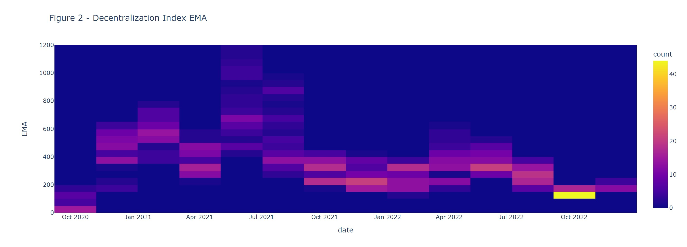

# Title
- provide key information: e.g., authorship, disclaimer, acknowledgments
- provide key references 
- insert feature photo 
- ...

## Table of Contents
- data
- code
- spotlight

## Data
- Data Source:
- Queried Data
- Processed Data
- ...

## Code
- Query Data
- Process Data
- Analyze Data
- ...

## Spotlight
- Posters
- Slides
- Presentations
- Review articles
- Media appearance
- ...

